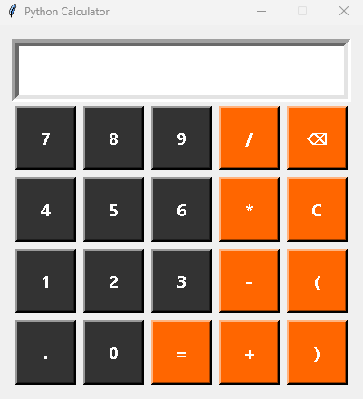

🖩 Python GUI Calculator

- A clean and simple calculator built with Python Tkinter.

- Dark gray number buttons and bright orange operator buttons 🎨

- Keyboard support (type directly, use Enter/Backspace/Escape) ⌨️

- Safe expression evaluation using Python’s ast module ✅

- Supports parentheses, decimals, powers, and modulus

🚀 Features

- GUI built with Tkinter (no extra installs needed)

- Safe math parsing (no eval, prevents unsafe code execution)

- Keyboard shortcuts

  - Enter / Numpad Enter → =

  - Backspace → ⌫

  - Escape → Clear

  - Operators supported: + - * / % ** ( )

📸 Screenshot

📚 How It Works

- Tkinter manages the window, buttons, and layout.

- AST (Abstract Syntax Tree) parses math expressions safely.

- Button grid is created dynamically for digits and operators.

- Custom colors distinguish numbers (dark gray) and operators (orange).

🔮 Future Improvements

- Dark mode toggle 🌙

- Calculation history panel 📜

- Memory buttons (M+, M-, MR, MC) 💾

- Hover effects for modern UI ✨

👨‍💻 Author

Made in Python by Trevor Hardig
